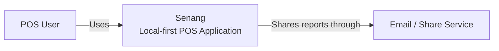
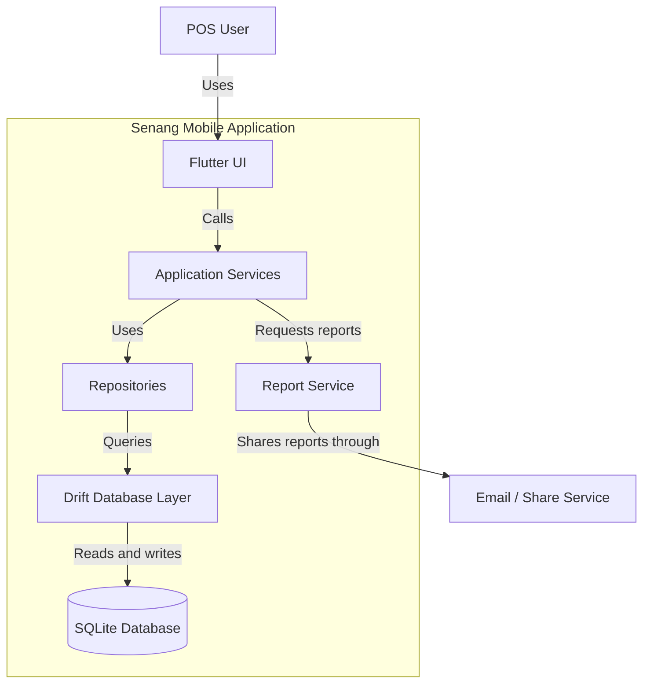
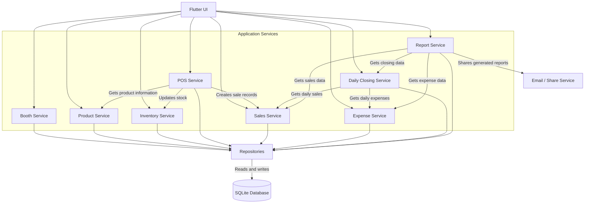

# Senang

**Senang** is a Flutter-based, local-first Point of Sale (POS) system designed for small businesses, booth operators, and vendors.

The goal of Senang is to provide a simple and flexible POS system where users can manage multiple booths, customize their inventory, record sales and expenses, and perform daily closing without requiring a constant internet connection.

## Features

### Booth Management

* Create and manage multiple booths under one account
* Keep inventory and sales separate for each booth
* Switch between booths easily

### Customizable Inventory

* Create and manage products
* Create product categories
* Set prices and stock quantities
* Support different types of businesses and products
* Allow users to customize inventory fields

### Point of Sale

* Add products to a cart
* Calculate totals automatically
* Record completed sales
* Support different payment methods
* Keep a record of previous transactions

### Sales & Expenses

* View sales history
* Record business expenses
* Track stock movements
* View daily sales and expenses

### Daily Closing

* Perform end-of-day closing
* Calculate daily sales and expenses
* Generate a daily closing report
* Share the report through email or other supported sharing apps

### Local-First

* Store business data locally on the device
* Continue using the POS without an internet connection
* Use SQLite for local data storage

## Technology Stack

| Technology   | Purpose                           |
| ------------ | --------------------------------- |
| Flutter      | Cross-platform mobile application |
| Dart         | Application programming language  |
| Drift        | Type-safe SQLite database layer   |
| SQLite       | Local data storage                |
| Git & GitHub | Version control                   |
| PDF / Excel  | Report generation                 |

## Architecture

Senang follows a local-first architecture designed to keep the application simple, reliable, and usable without an internet connection.

### C4 Context Diagram



### C4 Container Diagram



### C4 Component Diagram



### Architecture Layers

```text
Flutter UI
    ↓
Application Services
    ↓
Repositories
    ↓
Drift
    ↓
SQLite
```

The application is designed so that the user interface does not directly access the database. Business logic is handled by application services, while repositories manage communication with the local database.
## Project Structure

```text
senang_aa/
├── docs/
│   ├── architecture/
│   └── database/
│
├── lib/
│   ├── database/
│   ├── models/
│   ├── repositories/
│   ├── screens/
│   └── services/
│
├── test/
│
├── pubspec.yaml
└── README.md
```

## Development Roadmap

* [x] Create Flutter project
* [x] Set up Git repository
* [x] Connect project to GitHub
* [x] Design system architecture
* [ ] Design database schema
* [ ] Set up Drift and SQLite
* [ ] Implement booth management
* [ ] Implement inventory management
* [ ] Implement customizable inventory fields
* [ ] Implement POS and checkout
* [ ] Implement sales history
* [ ] Implement expense tracking
* [ ] Implement daily closing
* [ ] Implement PDF / Excel reports
* [ ] Implement email / sharing
* [ ] Testing
* [ ] Android release
* [ ] iOS release

## Project Status

Senang is currently under active development.

The current version is focused on establishing the project architecture, database structure, and core POS functionality before moving towards a production release.

## Contributing

This project is currently being developed as a personal project.

More contribution guidelines will be added as the project develops.

## License

License information will be added before the first public release.
