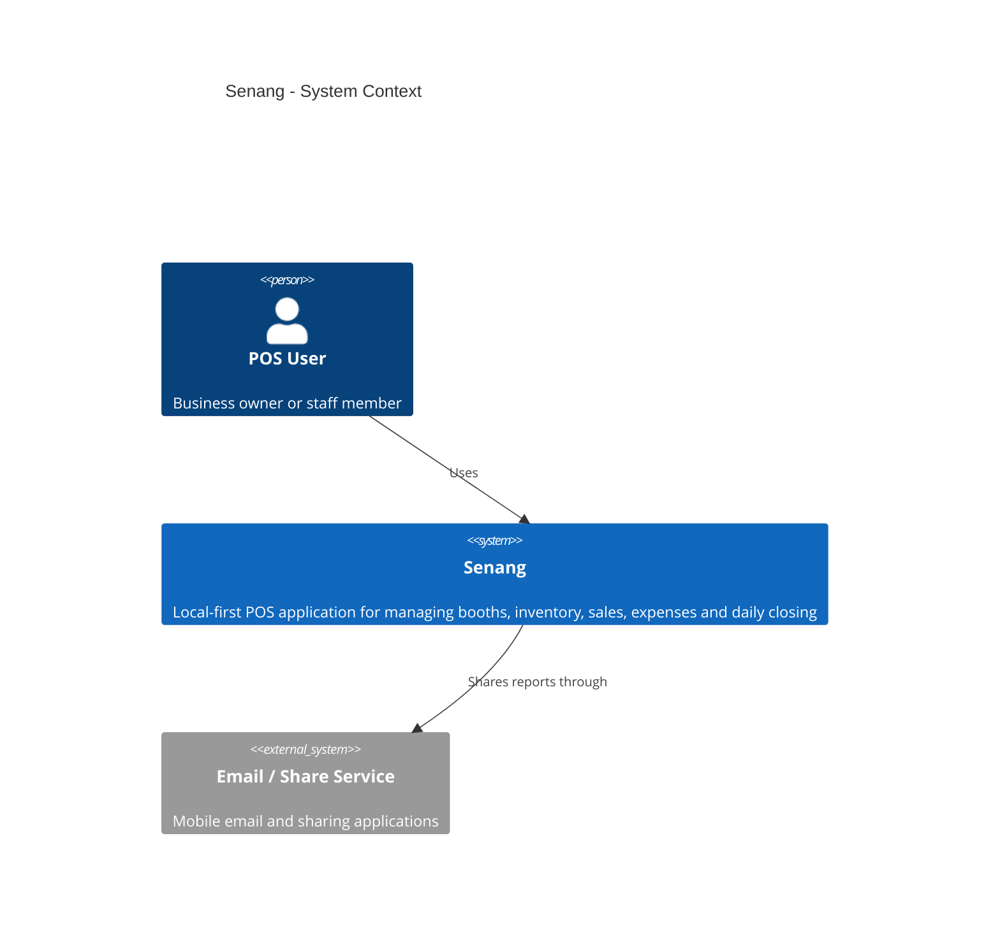

# Senang

**Senang** is a Flutter-based, local-first Point of Sale (POS) system designed for small businesses, booth operators, and vendors.

The goal of Senang is to provide a simple and flexible POS system where users can manage multiple booths, customize their inventory, record sales and expenses, and perform daily closing without requiring a constant internet connection.

## Features

### Booth Management

* Create and manage multiple booths under one account
* Keep inventory and sales separate for each booth
* Switch between booths easily

### Customizable Inventory

* Create and manage products
* Create product categories
* Set prices and stock quantities
* Support different types of businesses and products
* Allow users to customize inventory fields

### Point of Sale

* Add products to a cart
* Calculate totals automatically
* Record completed sales
* Support different payment methods
* Keep a record of previous transactions

### Sales & Expenses

* View sales history
* Record business expenses
* Track stock movements
* View daily sales and expenses

### Daily Closing

* Perform end-of-day closing
* Calculate daily sales and expenses
* Generate a daily closing report
* Share the report through email or other supported sharing apps

### Local-First

* Store business data locally on the device
* Continue using the POS without an internet connection
* Use SQLite for local data storage

## Technology Stack

| Technology   | Purpose                           |
| ------------ | --------------------------------- |
| Flutter      | Cross-platform mobile application |
| Dart         | Application programming language  |
| Drift        | Type-safe SQLite database layer   |
| SQLite       | Local data storage                |
| Git & GitHub | Version control                   |
| PDF / Excel  | Report generation                 |

## Architecture

Senang follows a local-first architecture.

### C4 Context Diagram



### C4 Container Diagram

```mermaid
C4Container

title Senang - Container Diagram

Person(user, "POS User", "Business owner or staff member")

System_Boundary(senang, "Senang Mobile Application") {

    Container(ui, "Flutter UI", "Flutter / Dart",
        "Mobile interface for POS, inventory, booths, sales, expenses and reports")

    Container(app, "Application Services", "Dart",
        "Contains business logic for checkout, inventory, expenses, closing and reporting")

    Container(repo, "Repositories", "Dart",
        "Provides an abstraction between business logic and database access")

    Container(drift, "Drift Database Layer", "Drift / Dart",
        "Provides type-safe database access and queries")

    ContainerDb(sqlite, "SQLite Database", "SQLite",
        "Stores accounts, booths, products, sales, expenses and other business data")

    Container(report, "Report Service", "Dart",
        "Generates PDF and Excel reports")
}

System_Ext(share, "Email / Share Service", "Mobile email and sharing applications")

Rel(user, ui, "Uses")
Rel(ui, app, "Calls")
Rel(app, repo, "Uses")
Rel(repo, drift, "Queries")
Rel(drift, sqlite, "Reads and writes")
Rel(app, report, "Requests reports")
Rel(report, share, "Shares reports through")
```

### C4 Component Diagram

```mermaid
C4Component

title Senang - Application Services Components

Container_Boundary(app, "Application Services") {

    Component(booth, "Booth Service", "Dart",
        "Manages booths and booth-specific data")

    Component(product, "Product Service", "Dart",
        "Manages products, categories and customizable product fields")

    Component(inventory, "Inventory Service", "Dart",
        "Manages stock quantities and stock movements")

    Component(pos, "POS Service", "Dart",
        "Handles cart operations, checkout and payments")

    Component(sales, "Sales Service", "Dart",
        "Manages completed sales and sales history")

    Component(expense, "Expense Service", "Dart",
        "Manages business expenses")

    Component(closing, "Daily Closing Service", "Dart",
        "Calculates and records end-of-day totals")

    Component(report, "Report Service", "Dart",
        "Generates PDF and Excel reports")
}

Container(ui, "Flutter UI", "Flutter / Dart",
    "Mobile user interface")

Container(repo, "Repositories", "Dart",
    "Database repository layer")

ContainerDb(db, "SQLite Database", "SQLite",
    "Local application database")

System_Ext(share, "Email / Share Service", "Mobile sharing applications")

Rel(ui, booth, "Uses")
Rel(ui, product, "Uses")
Rel(ui, inventory, "Uses")
Rel(ui, pos, "Uses")
Rel(ui, sales, "Uses")
Rel(ui, expense, "Uses")
Rel(ui, closing, "Uses")
Rel(ui, report, "Uses")

Rel(pos, product, "Gets product information")
Rel(pos, inventory, "Updates stock")
Rel(pos, sales, "Creates sale records")

Rel(closing, sales, "Gets daily sales")
Rel(closing, expense, "Gets daily expenses")

Rel(report, sales, "Gets sales data")
Rel(report, expense, "Gets expense data")
Rel(report, closing, "Gets closing data")

Rel(booth, repo, "Uses")
Rel(product, repo, "Uses")
Rel(inventory, repo, "Uses")
Rel(pos, repo, "Uses")
Rel(sales, repo, "Uses")
Rel(expense, repo, "Uses")
Rel(closing, repo, "Uses")
Rel(report, repo, "Uses")

Rel(repo, db, "Reads and writes")
Rel(report, share, "Shares generated reports")
```

The application is designed to keep the user interface, business logic, and database access separated so that the project can be expanded more easily in the future.

## Project Structure

```text
senang_aa/
├── docs/
│   ├── architecture/
│   └── database/
│
├── lib/
│   ├── database/
│   ├── models/
│   ├── repositories/
│   ├── screens/
│   └── services/
│
├── test/
│
├── pubspec.yaml
└── README.md
```

## Development Roadmap

* [x] Create Flutter project
* [x] Set up Git repository
* [x] Connect project to GitHub
* [x] Design system architecture
* [ ] Design database schema
* [ ] Set up Drift and SQLite
* [ ] Implement booth management
* [ ] Implement inventory management
* [ ] Implement customizable inventory fields
* [ ] Implement POS and checkout
* [ ] Implement sales history
* [ ] Implement expense tracking
* [ ] Implement daily closing
* [ ] Implement PDF / Excel reports
* [ ] Implement email / sharing
* [ ] Testing
* [ ] Android release
* [ ] iOS release

## Project Status

Senang is currently under active development.

The current version is focused on establishing the project architecture, database structure, and core POS functionality before moving towards a production release.

## Contributing

This project is currently being developed as a personal project.

More contribution guidelines will be added as the project develops.

## License

License information will be added before the first public release.
